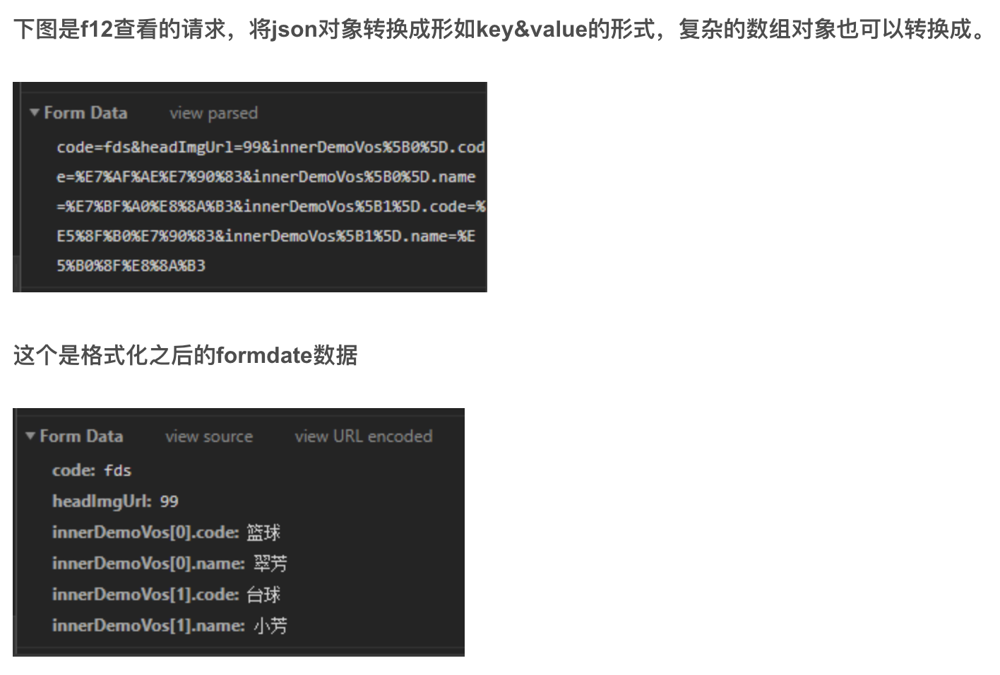
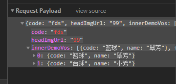

  ### Content-Type设置为 application/x-www-form-urlencoded 或者 application/json

  post请求：
  1. application/x-www-form-urlencoded。 这种格式，会将参数转化为： key=value&key1=value1

  2. application/json。 这种格式，会将参数转化为：json字符串

  3. multipart/form-data。 用于文件上传，此时form的enctype属性必须指定为multipart/form-data。请求体被分割成多部分，每部分使用—boundary分割。

  4. text/xml

get请求：
GET 请求不存在请求实体部分，键值对参数放置在 URL 尾部，浏览器把form数据转换成一个字串（name1=value1&name2=value2...），然后把这个字串追加到url后面，用?分割，加载这个新的url。因此请求头不需要设置 Content-Type 字段